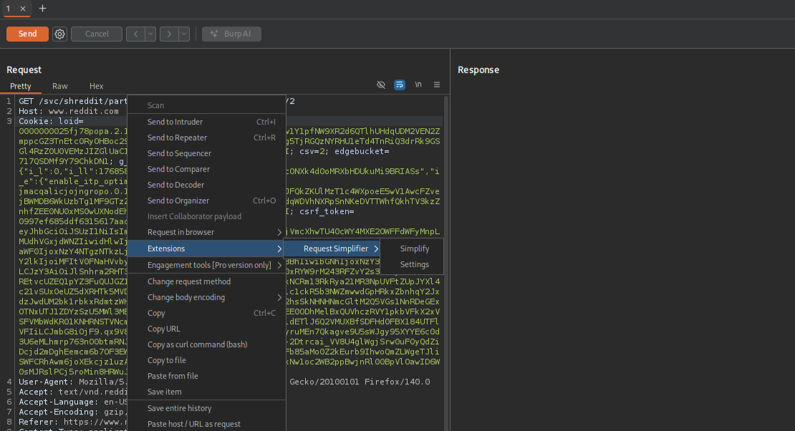
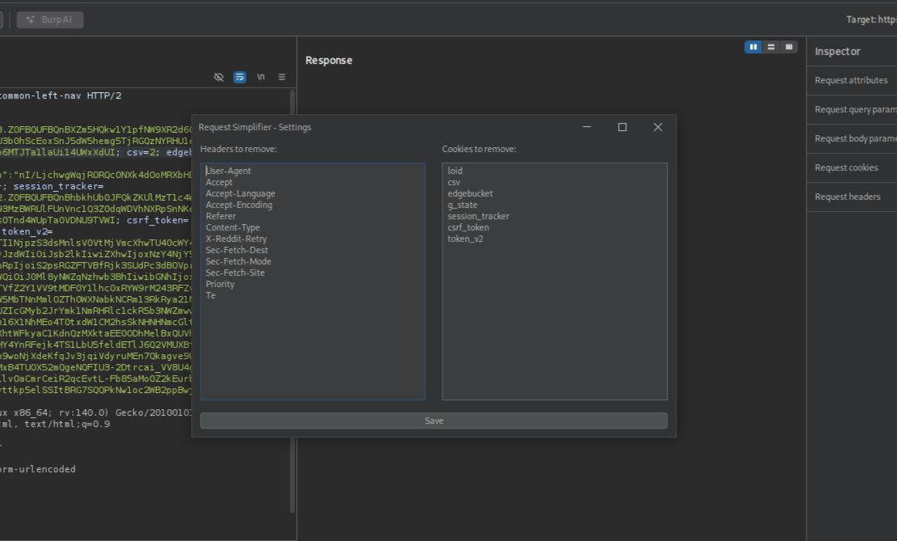

# Request Simplifier

**Request Simplifier** is a small and simple Burp Suite extension that helps you remove unnecessary headers and cookies from HTTP requests.

When I test web applications, I often simplify up requests to make them easier to read and work with. It also helps when writing bug bounty reports — for example, triager once asked me for more information when he got a 304 Not Modified response because of a header. I looked for an extension that does this automatically, but I couldn’t find any. So I built my own.

Request Simplifier is very simple and lightweight so it won’t slow down Burp Suite. You can use the default settings to remove common headers, or customize it to remove exactly what you want. The settings window is very user-friendly — it fills in all headers and cookies from the current request, and you just delete the ones you want to keep.

---

## Installation

1. Download **Jython Standalone** and set it as your Python environment in Burp Suite:  
   `Settings > Extensions > Python Environment`
2. Add this extension as a Python extension:  
   `Extensions > Add > Select the .py file`

---

## Usage

#### Simplify a request
Right-click on a request in Repeater or HTTP history and choose:  `Extensions > Request Simplifier > Simplify`  
This removes headers and cookies based on your saved or default settings.

#### ⚙️ Configure what gets removed
Right-click on a request and choose: `Extensions > Request Simplifier > Settings`  
You’ll see a window where you can select which headers and cookies should be removed. Your choices will be saved and used every time you click "simplify".

---

## Screenshots

#### Estimated system impact

#### Usage

#### Settings

